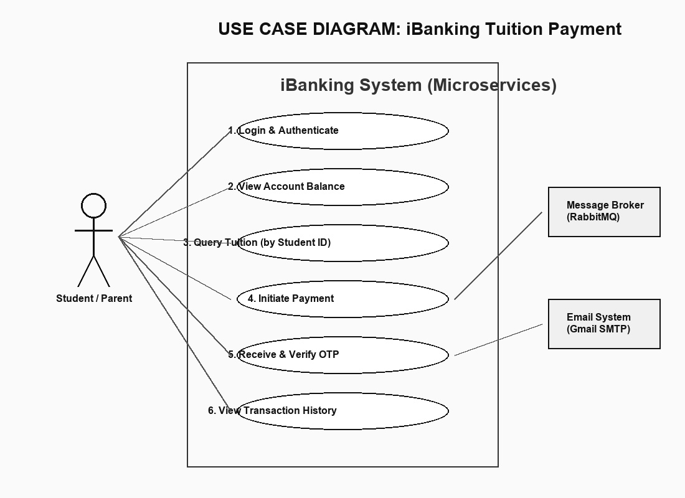
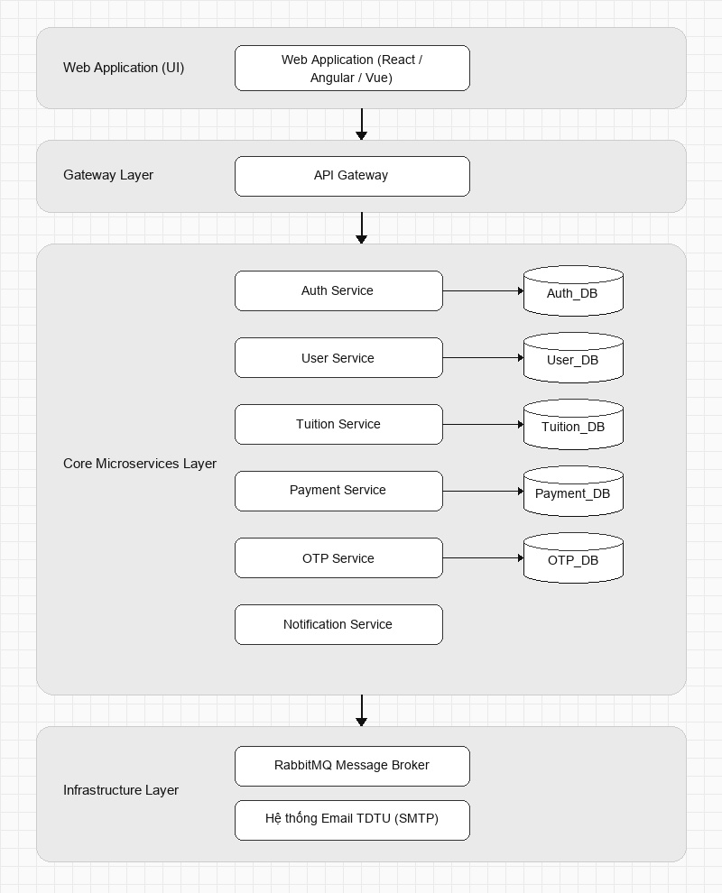
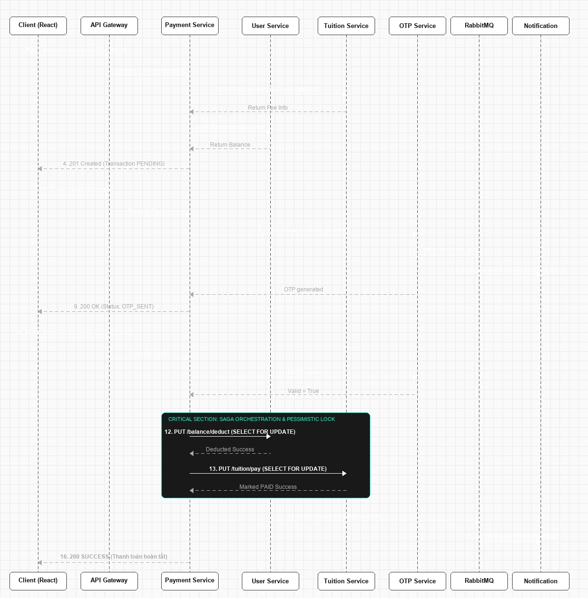
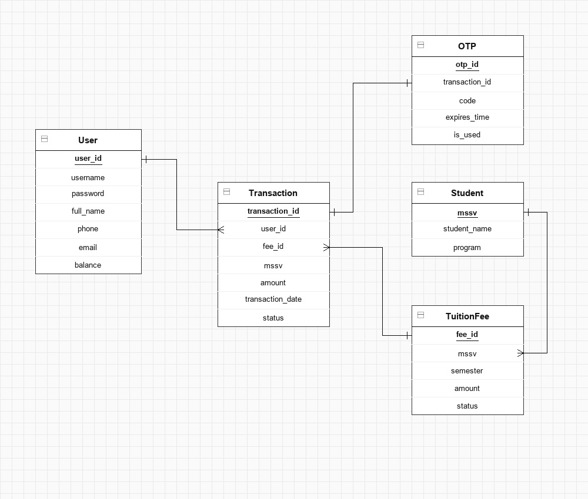

# BÁO CÁO ĐỒ ÁN GIỮA KỲ
## Môn học: Kiến trúc Hướng Dịch vụ (SOA)
**Đề tài:** Hệ thống thanh toán học phí trực tuyến (iBanking Tuition Payment) sử dụng Microservices

**Giảng viên hướng dẫn:** [Tên Giảng Viên]
**Sinh viên thực hiện:** Lê Phú (MSSV: 524h0121)

---

# Team Members & Contribution Rates

| Student ID | Full Name | Academic Email | Assigned Responsibilities | Completion |
| --- | --- | --- | --- | --- |
| 524H0121 | Lê Phú | 524h0121@student.tdtu.edu.vn | Toàn bộ dự án (Phân tích, Thiết kế, Cài đặt Microservices, React Frontend, Docker) | 100% |

---

# Tổng quan hệ thống & Usecase (Frontend GUI)

- **Giao diện React.js:** Mô phỏng ứng dụng iBanking chuyên nghiệp.
- **Tính năng chính:**
  - Đăng nhập & Xác thực JWT.
  - Tra cứu thông tin học phí sinh viên theo MSSV.
  - Hiển thị số dư tài khoản theo thời gian thực.
  - Xác nhận OTP qua Email và xem Lịch sử giao dịch.



---

# Kiến trúc Microservices & API Gateway

- **Phân tách dịch vụ:** 6 Microservices độc lập (Auth, User, Tuition, Payment, OTP, Notification).
- **Database-per-service:** 5 cơ sở dữ liệu PostgreSQL riêng biệt, không dùng khóa ngoại chéo.
- **API Gateway:**
  - Điểm truy cập duy nhất (Single Entry Point).
  - Xác thực token (JWT Auth) và định tuyến (Routing).
  - Theo dõi request bằng header `X-Correlation-ID`.



---

# Giao dịch phân tán (Saga Pattern)

**Bài toán:** Đảm bảo tính nhất quán dữ liệu trên nhiều DB (Trừ tiền ở User DB và Cập nhật trạng thái ở Tuition DB).
- **Cơ chế Orchestration:** Payment Service đóng vai trò điều phối trung tâm.
- **Rollback (Compensation):** 
  - Nếu trừ tiền thành công nhưng cập nhật học phí thất bại (ví dụ: bị người khác thanh toán trước), Payment Service sẽ gọi User Service để **hoàn tiền (Refund)**.
  - Đảm bảo tính ACID trong môi trường phân tán.



---

# Xử lý tương tranh (Concurrency Control)

**Vấn đề:** 
1. *Double-spending:* Một user gửi nhiều request thanh toán cùng lúc.
2. *Race Condition:* Nhiều người cùng nộp một khoản học phí.

**Giải pháp:** Áp dụng **Khóa bi quan (Pessimistic Locking)** ở mức Database.
- Dùng lệnh `SELECT ... FOR UPDATE` khi đọc số dư và trạng thái học phí.
- Các transaction đến sau phải chờ transaction trước hoàn tất giải phóng khóa.

```python
# Code minh họa trong User Service (Khóa dòng dữ liệu)
result = await db.execute(
    select(UserProfile)
    .where(UserProfile.id == user_id)
    .with_for_update()
)
```

---

# Giao tiếp bất đồng bộ (Asynchronous Communication)

**Tối ưu hiệu năng bằng RabbitMQ:**
- Các tác vụ không cần chờ kết quả ngay (như gửi Email) được đẩy vào Message Queue.
- **Notification Service** đóng vai trò Worker độc lập:
  - Lắng nghe queue `otp_email`: Gửi mã OTP xác thực (hiệu lực 5 phút).
  - Lắng nghe queue `payment_success`: Gửi biên lai điện tử qua email.
- Tích hợp `aiosmtplib` gửi email thực tế qua SMTP server của Gmail.

---

# Thiết kế Cơ sở dữ liệu (ERD)

- Phân rã dữ liệu hợp lý (Data Decentralization).
- **Payment Service** lưu bản ghi giao dịch toàn vẹn để đối soát.
- **Idempotency Key:** Cơ chế ngăn chặn gửi trùng request từ Frontend, đảm bảo 1 giao dịch chỉ được tạo 1 lần duy nhất dù nhấn nút nhiều lần.



---

# Đánh giá: Ưu điểm & Hạn chế

**Ưu điểm (Advantages):**
- **Toàn vẹn dữ liệu:** Giải quyết triệt để vấn đề thanh toán đồng thời (Concurrency) và nhất quán dữ liệu (Saga).
- **Khả năng mở rộng (Scalability):** Dễ dàng nhân bản (scale up) các service chịu tải cao (như Payment).
- **Bảo mật:** Luồng OTP thực tế và JWT an toàn.

**Hạn chế & Hướng khắc phục (Limitations & Trade-offs):**
- **Độ trễ mạng:** Gọi API nội bộ qua lại nhiều lần làm tăng latency $\rightarrow$ *Có thể dùng gRPC thay thế HTTP REST trong tương lai.*
- **Khó debug:** Truy vết lỗi trên nhiều service khó khăn $\rightarrow$ *Đã cài đặt `X-Correlation-ID` để log và tra cứu.*

---

# Mức độ hoàn thành & Tiêu chí đánh giá

| Yêu cầu / Tiêu chí | Mô tả công việc & Deliverables | Trạng thái |
| --- | --- | --- |
| **Req 1: Microservices** | Kiến trúc đa dịch vụ + API Gateway (FastAPI) | 100% (Pass) |
| **Req 2: Database** | DB độc lập (PostgreSQL), không khóa ngoại xuyên service | 100% (Pass) |
| **Req 3: Phân tán** | Cài đặt Saga Pattern (Orchestration) cho giao dịch | 100% (Pass) |
| **Req 4: Tương tranh** | Cài đặt Pessimistic Locking (FOR UPDATE) | 100% (Pass) |
| **Req 5: Bất đồng bộ** | Sử dụng Message Broker (RabbitMQ) & Gửi Email | 100% (Pass) |
| **Req 6: Frontend GUI** | Giao diện React chuyên nghiệp, gọi qua Gateway | 100% (Pass) |
| **Req 7: Triển khai** | Đóng gói và chạy trơn tru với Docker Compose | 100% (Pass) |

---

# Thank You for Your Attention

**Q&A Session**
*(Demo ứng dụng thực tế và chạy Script Python tự động Test Concurrency)*
